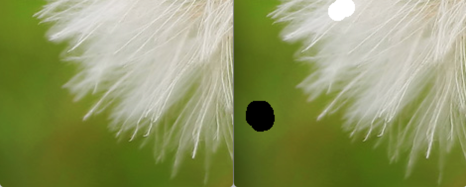
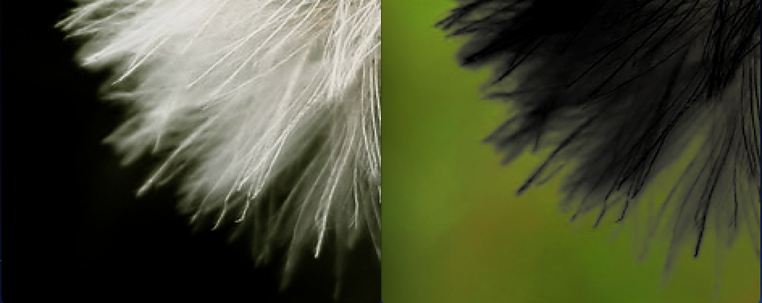
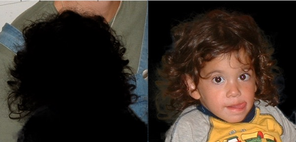

## Natural Image Matting

This algorithm separates the background and foreground with a few scribbles as constriction.

The part of this code tries to realize this algorithm in iOS so we can learn whether Image Matting can be performed well or not in mobile devices.

The code is written by myself but the train of thought is derived from http://www.wisdom.weizmann.ac.il/~levina/papers/Matting-Levin-Lischinski-Weiss-CVPR06.pdf. 

The functions acting the calculation are from the libraries of openCV, Eigen and Suitesparse. 

## Note 
1. Skip eroding.

## Update Log
02/05/2016: First version code. Still hard coded.

02/05/2016: Code polished and not hard coded anymore.

## Demo
### input:

### output:

### Other output:

### Other output:

